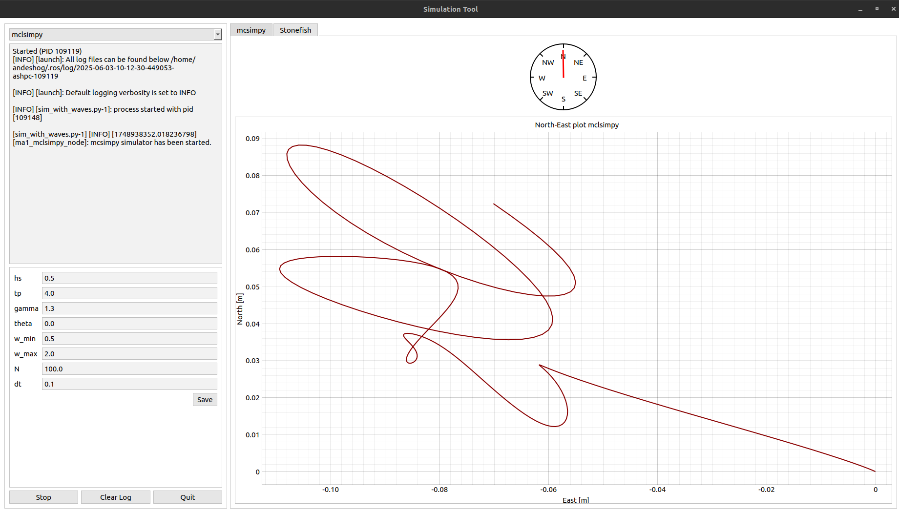
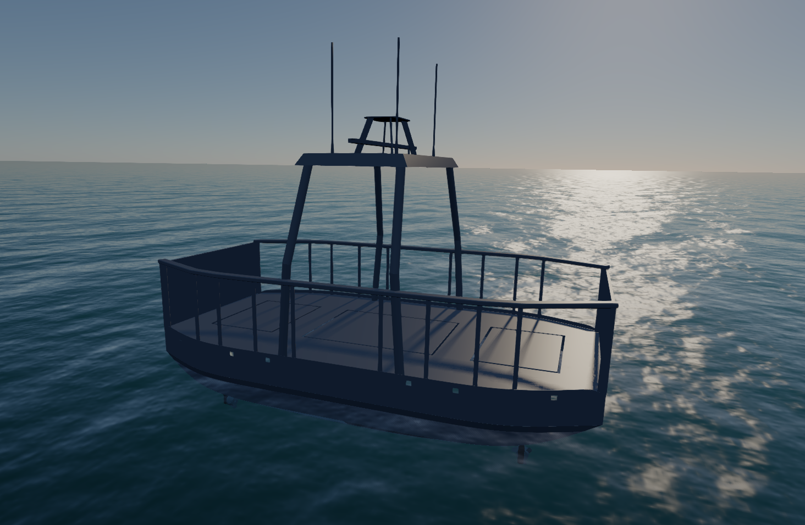

This repository contains a simulation tool for the milliAmpere 1 vessel.

### Prerequisites

- The [Stonefish](https://github.com/patrykcieslak/stonefish) library needs to be installed.
- The [Stonefish ROS 2 package](https://github.com/patrykcieslak/stonefish_ros2) must be compiled.
- The [mcsimpy simulator](https://github.com/NTNU-MCS/mcsimpy) must be installed.

The workspace needs to be built with the `symlink-install` flag such that the edited parameters are applied without needing to rebuild.

### Simulation tool

The idea is to manage multiple simulators, each with distinct usecases, in a single interface.

Functionality:
- Start/stop simulators
- Basic visualization
- Edit parameters

### Stonefish
Includes a simulation of milliAmpere1.
